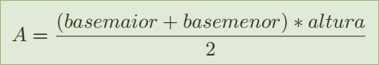

# Área de um trapézio.

## Descrição
Faça um programa que calcule e mostre a área de um trapézio. Sabendo-se que:

## Formato de entrada

Os valores (inteiros) da base menor, da base maior e da altura.

## Formato de saída

A área do trapézio com aproximação de 1 casa decimal.

## Exemplos de:

| Entrada | Saída |
| -- | -- |
|17 |  66.5 |
|2 |
|7 |

| Entrada | Saída |
| -- | -- |
| 20 | 81.0
| 7 | 
| 6 |

| Entrada | Saída |
| -- | -- |
| 14 | 47.5 |
| 5 |
| 5 |

[Ver no TheHuxley](https://thehuxley.com/problem/1099)